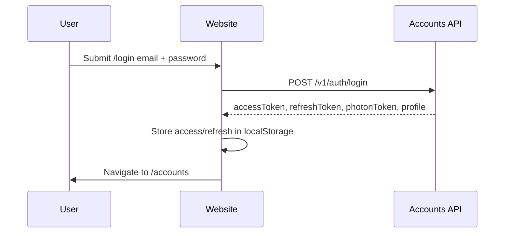
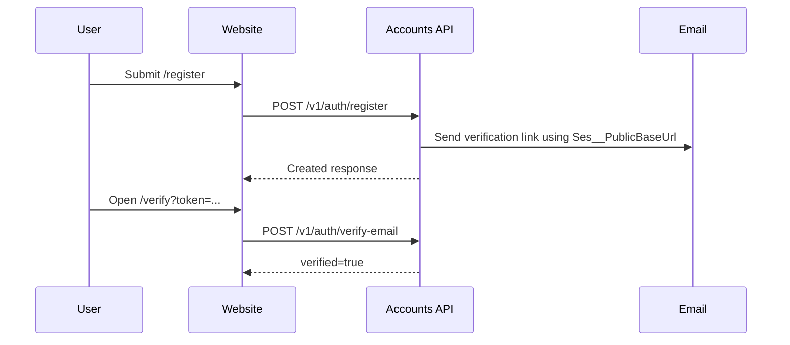
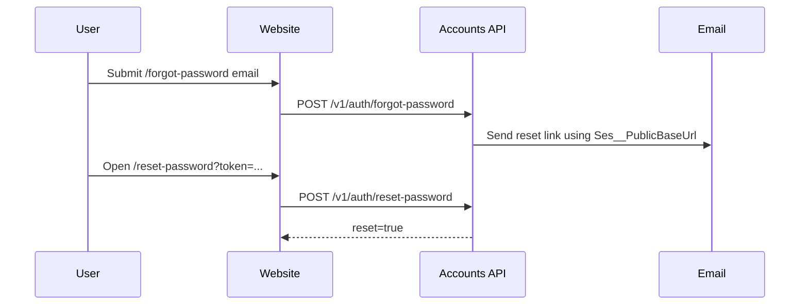
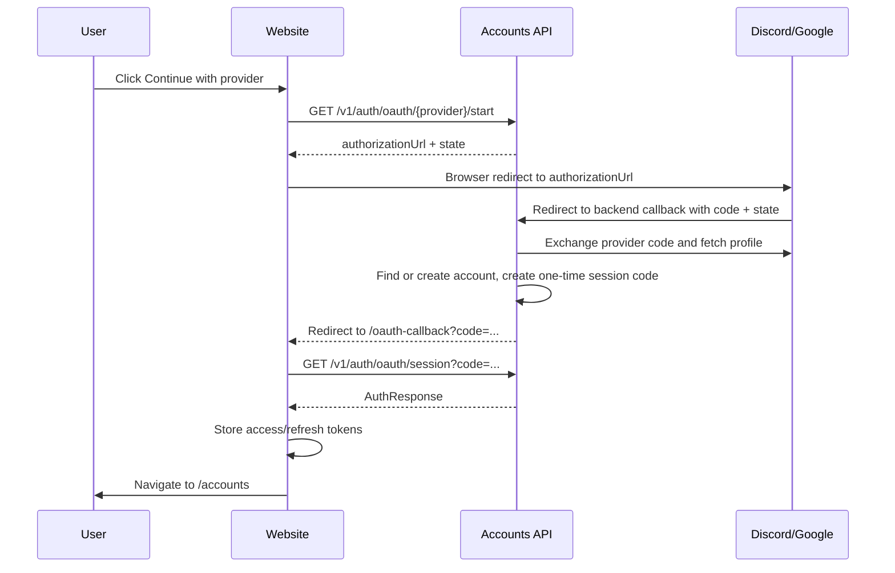

# Website Auth Flow

This website is the primary player-facing account UI. The AoTTG2 Accounts service remains the source of truth and API backend. `accounts.aottg2.com` can stay online as a fallback while the website replaces its frontend flows.

## Runtime Boundary

```text
Browser
  -> Aottg2-Website React routes
  -> src/auth/AuthProvider + authApi
  -> AoTTG2 Accounts API at VITE_AUTH_API_BASE_URL
  -> PostgreSQL / OAuth providers / email provider
```

The website never stores provider secrets. All secrets stay in the accounts service or provider dashboards.

## Website Routes

| Route | Purpose | Accounts API calls |
| --- | --- | --- |
| `/login` | Email/password login plus Discord/Google start buttons. | `POST /v1/auth/login`, `GET /v1/auth/oauth/{provider}/start` |
| `/register` | Email/password account registration plus OAuth start buttons. | `POST /v1/auth/register`, `GET /v1/auth/oauth/{provider}/start` |
| `/verify?token=...` | Email verification link target. | `POST /v1/auth/verify-email` |
| `/resend-verification` | Request another verification email. | `POST /v1/auth/resend-verification` |
| `/forgot-password` | Request password reset email. | `POST /v1/auth/forgot-password` |
| `/reset-password?token=...` | Password reset link target. | `POST /v1/auth/reset-password` |
| `/oauth-callback?code=...` | Browser OAuth completion. | `GET /v1/auth/oauth/session?code=...` |
| `/accounts` | Account/profile management. | `GET/PATCH/DELETE /v1/me`, `GET /v1/patreon/oauth/start`, `DELETE /v1/patreon/link`, `POST /v1/auth/logout` |
| `/admin` | Permission-gated admin/moderator panel. Requires an admin-module permission such as `users.read`, `roles.read`, `permissions.read`, or `audits.read`. | `GET/PATCH/DELETE /v1/admin/*` according to granted permissions |
| `/account` | Compatibility redirect. | Redirects to `/accounts` |

## Frontend Environment

The only required frontend variable is public and safe to expose:

```env
VITE_AUTH_API_BASE_URL=/accounts-api
```

The website proxies `/accounts-api/*` to `https://accounts.aottg2.com/*` in Vite dev server and Vercel. This avoids browser CORS problems while still using the production accounts API.

Direct API examples are valid only if the accounts API CORS allows the website origin:

```env
VITE_AUTH_API_BASE_URL=https://accounts.aottg2.com
VITE_AUTH_API_BASE_URL=http://localhost:5000
# or if 5000 is occupied:
VITE_AUTH_API_BASE_URL=http://localhost:5010
```

## Accounts Service Configuration

For production website takeover, configure the accounts API like this:

```env
Cors__AllowedOrigins=https://<website-domain>;https://accounts.aottg2.com
Discord__RedirectUri=https://accounts.aottg2.com/v1/auth/oauth/discord/callback
Google__RedirectUri=https://accounts.aottg2.com/v1/auth/oauth/google/callback
Discord__FrontendCallbackUrl=https://<website-domain>/oauth-callback
Google__FrontendCallbackUrl=https://<website-domain>/oauth-callback
Ses__PublicBaseUrl=https://<website-domain>
```

Provider dashboards must allow the backend callback URLs:

```text
https://accounts.aottg2.com/v1/auth/oauth/discord/callback
https://accounts.aottg2.com/v1/auth/oauth/google/callback
```

Email links use `Ses__PublicBaseUrl`, so that value must point at the website for verification and password reset links to land on the new UI.

## Email/Password Login



Tokens use the same browser storage keys as the accounts portal:

```text
aottg2_access
aottg2_refresh
```

On API `401`, `authApi` tries one refresh rotation through `POST /v1/auth/refresh`, stores the replacement tokens, and retries the original request once.

## Registration And Verification



`/resend-verification` always shows a generic success-style message so the UI does not leak whether an email is registered.

## Password Reset



## Discord And Google OAuth

The accounts service owns OAuth secrets and provider token exchange. The website only starts the flow and exchanges the final one-time session code.



Important security behavior: browser URLs receive only a short-lived one-time `code`. Access and refresh tokens are returned in the `/oauth/session` response body and are not placed in provider callback URLs.

## Account Page

`/accounts` is protected by frontend auth state. Signed-out users are redirected to `/login`. The page supports:

- profile display
- display name update through `PATCH /v1/me`
- Patreon link through `GET /v1/patreon/oauth/start`
- Patreon unlink through `DELETE /v1/patreon/link`
- account deletion through `DELETE /v1/me`
- logout through `POST /v1/auth/logout`

## Patreon Note

Current Patreon OAuth completion is still API-centric: `/v1/patreon/oauth/callback` returns JSON. The website can start Patreon linking and unlink existing links, but a polished browser return path may require a small accounts-service enhancement, such as `Patreon__FrontendCallbackUrl` and redirecting back to `/accounts?patreon=linked` or `/accounts?patreon=error`.

## Local Development

1. Start Postgres for accounts service.
2. Start accounts API.
3. Set website `.env.local`:

```env
VITE_AUTH_API_BASE_URL=http://localhost:5000
```

If port `5000` is occupied:

```env
VITE_AUTH_API_BASE_URL=http://localhost:5010
```

4. Start website:

```bash
npm run dev
```

5. Validate:

```bash
npm run lint
npm run build
npm run test:e2e:auth
```

## Deployment Checklist

- [ ] Website has `VITE_AUTH_API_BASE_URL=/accounts-api` unless direct CORS is intentionally configured.
- [ ] Vercel rewrites `/accounts-api/:path*` to `https://accounts.aottg2.com/:path*`.
- [ ] If using direct API URL instead of proxy, Accounts API CORS includes the website origin.
- [ ] Discord provider callback URL points to accounts API callback.
- [ ] Google provider callback URL points to accounts API callback.
- [ ] `Discord__FrontendCallbackUrl` points to website `/oauth-callback`.
- [ ] `Google__FrontendCallbackUrl` points to website `/oauth-callback`.
- [ ] `Ses__PublicBaseUrl` points to the website origin.
- [ ] `accounts.aottg2.com` remains online as API/fallback until migration is accepted.
- [ ] Playwright login smoke test passes against the deployed environment or a safe staging environment.
